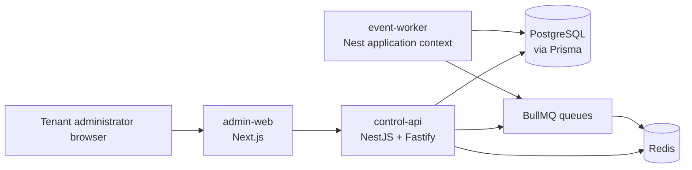
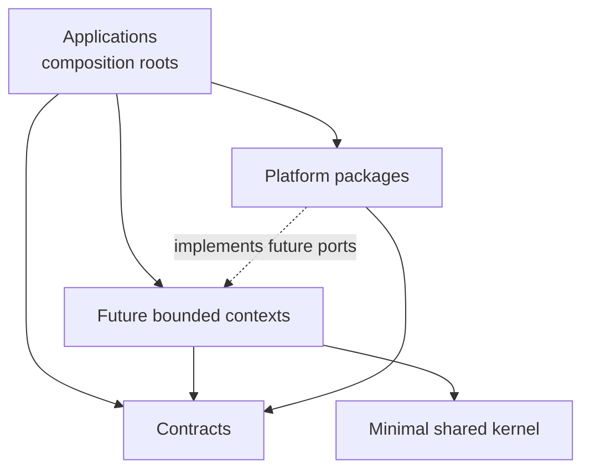

# Phase 1 — Project Foundation Architecture

| Field   | Value                                                              |
| ------- | ------------------------------------------------------------------ |
| Status  | Implemented foundation                                             |
| Version | 1.0.0                                                              |
| Date    | 2026-07-25                                                         |
| Parent  | [Phase 0 Software Architecture Document](SOFTWARE_ARCHITECTURE.md) |

## Purpose

Phase 1 turns the Phase 0 architecture into a compilable, testable, containerized monorepo without
adding business behavior. It creates composition roots and platform adapters that future bounded
contexts can consume without coupling domain logic to frameworks or vendors.

## Deployment units

### Admin web

The web shell uses the Next.js App Router, React strict mode, Tailwind CSS, shadcn/ui conventions,
React Query, React Hook Form, Zod, and `next-themes`. The initial page communicates foundation
status only. It contains no tenant or business feature.

### Control API

The API shell uses NestJS with the Fastify adapter. Its composition root wires:

- validated process configuration;
- structured Pino logging with correlation IDs and redaction;
- centralized `application/problem+json` error responses;
- PostgreSQL through an injectable Prisma lifecycle;
- Redis through an injectable cache lifecycle;
- BullMQ connection defaults;
- URI versioning at `/api/v1`;
- OpenAPI at `/docs`;
- process liveness and dependency readiness endpoints.

### Event worker

The worker is a Nest standalone application context. It establishes database, queue, logging, and
shutdown wiring but registers no business processor. Future processors must live in their owning
bounded context and be composed here.

## Package dependency rules

Allowed:

- applications import public entry points from platform and context packages;
- platform packages import transport contracts when required;
- context application layers define ports that platform adapters implement;
- context packages import only stable shared-kernel primitives.

Forbidden:

- a package importing an application;
- a domain package importing NestJS, Prisma, Redis, BullMQ, or a provider SDK;
- deep imports into another package;
- shared-kernel growth for convenience;
- cross-context persistence access.

ESLint import rules and Nx's project graph provide initial automated enforcement. Explicit Nx tags
and dependency constraints will be added with the first bounded-context packages, when those tags
have real targets to constrain.

## Configuration architecture

Backend environment values are parsed once through a strict Zod schema. Invalid required values
fail startup with a safe aggregated message. Empty optional secrets normalize to `undefined`.
Client-exposed values have a separate allowlisted schema and use the `NEXT_PUBLIC_` convention.

Configuration precedence:

1. environment or secret-manager injection;
2. schema defaults for safe non-secret local behavior;
3. immutable typed configuration consumed by composition roots.

Tenant configuration does not belong in process environment and will be versioned in PostgreSQL in
later phases.

## Data architecture

Prisma is configured against PostgreSQL but intentionally contains no models. Domain tables and
migrations will be introduced by the bounded context that owns them. `PrismaService` is an
infrastructure lifecycle and health primitive, not a repository exposed to future domain layers.

Redis is configured for short-lived infrastructure concerns. The cache client:

- connects lazily;
- uses bounded per-request retries;
- supports TLS and database selection;
- shuts down gracefully;
- exposes only an infrastructure health check in Phase 1.

## Queue architecture

BullMQ is configured with:

- a stable platform prefix;
- exponential retry backoff;
- bounded retention for completed and failed jobs;
- Redis options compatible with blocking worker operations;
- an infrastructure queue registration proving composition.

BullMQ jobs are operational commands with at-least-once behavior. They must be idempotent. They do
not replace the Phase 0 Kafka-compatible integration-event broker, transactional outbox, schema
registry, or replayable business streams.

## HTTP and error architecture

All unhandled errors pass through one global filter. Expected application failures use a typed
`ApplicationError`. Transport responses follow a stable Problem Details shape with:

- HTTP status;
- safe title and detail;
- stable machine code;
- problem type;
- request instance;
- correlation ID;
- optional field-level details.

Unexpected errors are logged with internal context but return a generic message. Sensitive headers
and common secret fields are redacted at the logger boundary.

## Health model

- **Liveness** answers whether the process event loop can serve a request. It does not query
  dependencies, preventing cascading restarts during database outages.
- **Readiness** measures PostgreSQL and Redis connectivity concurrently and returns unavailable if
  either required dependency fails.

Kubernetes and Docker should route traffic based on readiness and restart only on liveness failure.

## Frontend foundation

The design system uses CSS variables and OKLCH colors with light, dark, and system preferences.
shadcn/ui remains source-owned: components are committed and can be reviewed rather than hidden in
a runtime dependency. Provider composition is centralized so future global concerns remain
explicit.

React Query defaults avoid refetch storms while retaining bounded retry behavior. React Hook Form
and Zod are installed as the future form and validation standards; no speculative forms are
implemented in this phase.

## Build and delivery

- pnpm owns workspace dependency resolution.
- Nx schedules and caches package scripts from the workspace graph.
- TypeScript compiles platform packages before deployable applications.
- GitHub Actions checks formatting, linting, types, tests, builds, Prisma generation, and Compose
  validity against PostgreSQL and Redis service containers.
- Husky and lint-staged provide fast local feedback; CI remains authoritative.
- Docker uses multi-stage, pinned Node Alpine images and non-root runtime users.
- Next.js standalone output and pnpm deploy minimize runtime contents.

## Security baseline

- Containers run as non-root with `no-new-privileges`.
- Database and Redis ports bind to loopback for local development.
- HTTP defaults include Helmet, explicit CORS, body limits, and trusted-proxy handling.
- Logs redact authorization, cookies, API keys, and common secret fields.
- Swagger can be disabled by environment and should be restricted or disabled in production.
- CI has read-only repository permissions.
- Dependabot monitors JavaScript, GitHub Actions, and Docker dependencies.
- Secrets are excluded from Git and not embedded in images.

## Extension procedure

When adding the first bounded context:

1. Create `packages/contexts/<context>` with domain, application, infrastructure, and interface
   layers.
2. Export only its public composition contract.
3. Define repositories and external dependencies as inward-facing ports.
4. Add tenant-aware persistence models in the context's schema ownership area.
5. Compose the context in an application root.
6. Add unit, integration, contract, security, observability, and migration evidence.
7. Record material decisions as ADRs.

## Deliberate exclusions

- authentication and authorization;
- tenant, product, order, or payment models;
- AI, telephony, WhatsApp, email, SMS, and payment providers;
- durable integration-event broker;
- object storage;
- business queue processors;
- production cloud and Kubernetes manifests.

These are excluded because Phase 1 establishes infrastructure only. Their contracts and controls
will be introduced in the roadmap phase that owns them.
