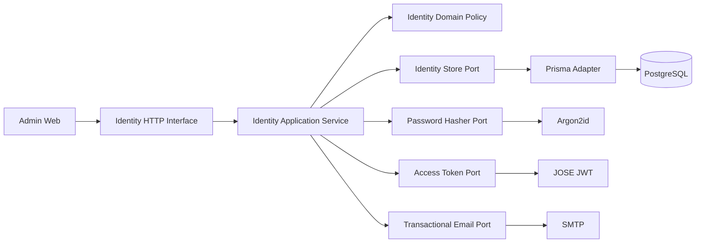
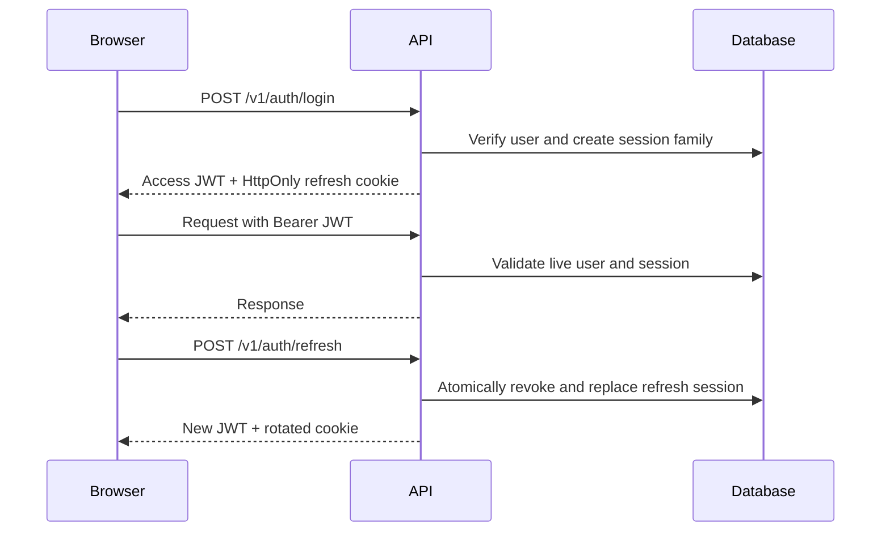

# Phase 2: Enterprise Authentication

## Scope

Phase 2 adds platform identity only. Company configuration, tenant membership, products, AI,
telephony, and payments remain outside this bounded context.

## Topology

## Ownership and API

The context owns users, sessions, verification tokens, reset tokens, login history, and audit logs.
Token tables contain hashes only. `role` is a platform role; multi-tenant memberships will be
separate aggregates.

The versioned surface includes login, refresh, logout, current user, recovery, verification, session
listing/revocation, Admin listing/invitation/removal, audit logs, and login history. Guards enforce
authentication and permission metadata. The application service repeats resource authorization so
business policy is not dependent on HTTP.

## Frontend

The admin web app provides login, recovery, password reset, invitation activation, protected
dashboard, session management, and Super-Admin-only administrator management. Access tokens stay in
memory. Middleware cookie checks improve navigation but are never an authorization boundary.

## Operations

- Generate `AUTH_JWT_SECRET` as at least 32 random bytes encoded in Base64.
- Configure production SMTP before inviting Admins.
- Apply database migrations before API rollout.
- Run Super Admin bootstrap exactly once, then remove its password from deployment secrets.
- Configure audit/login-history retention and export when compliance policy is approved.
