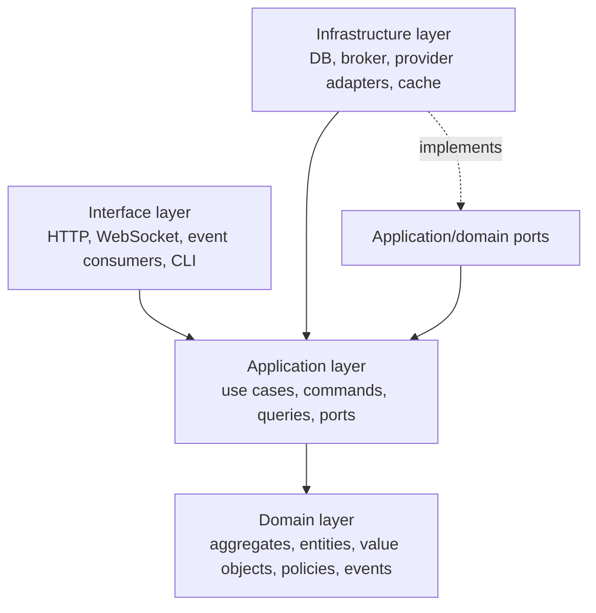
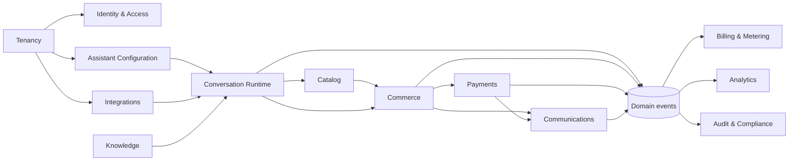
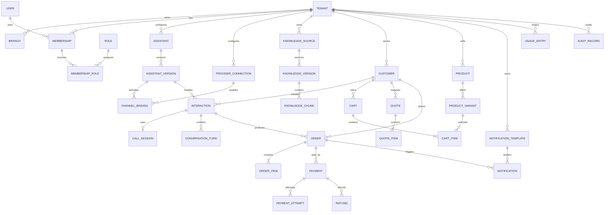
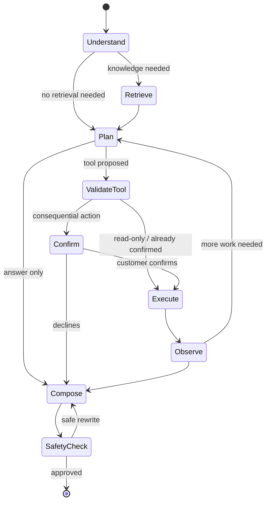
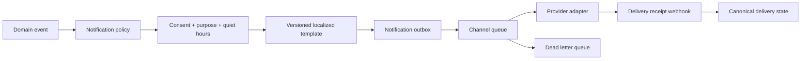
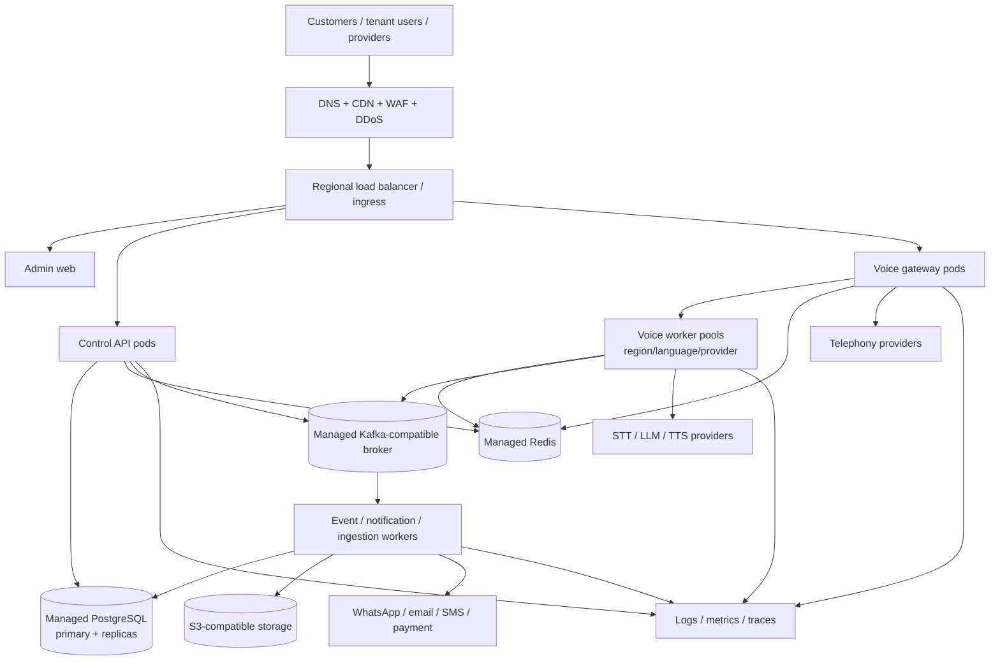
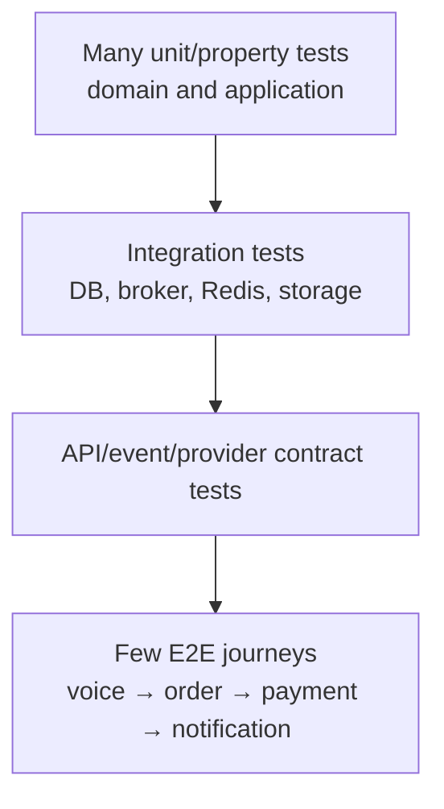
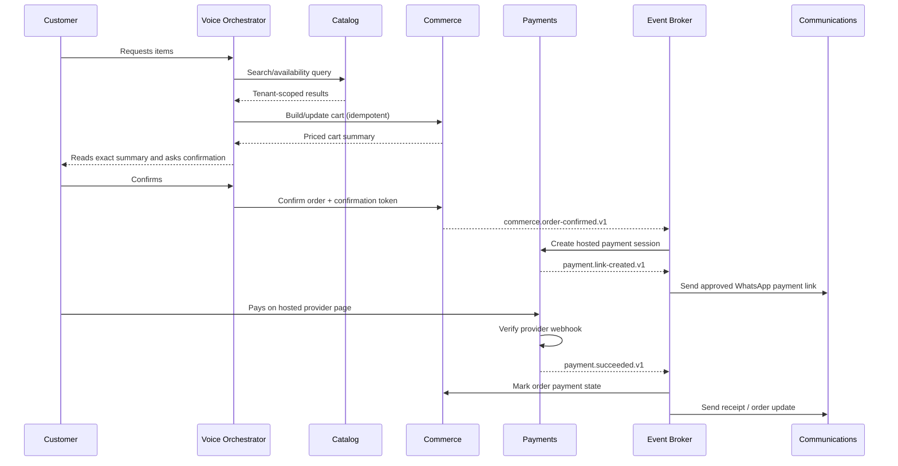

# AI Voice Commerce Platform — Software Architecture Document

| Field | Value |
|---|---|
| Document status | Phase 0 architecture baseline |
| Version | 1.0.0 |
| Date | 2026-07-25 |
| Audience | Engineering, security, product, SRE, data, and compliance teams |
| Architecture style | Tenant-aware modular monolith with event-driven, microservice-ready boundaries |
| Classification | Internal |

## 1. Executive Summary

The AI Voice Commerce Platform is an enterprise SaaS product through which businesses configure multilingual AI voice assistants. Customers call a business-specific number to ask questions, place orders, request quotes, make payments through secure payment-provider flows, and receive WhatsApp or other notifications.

The system must serve thousands of businesses without allowing one tenant's load or data to affect another. It must remain available during partial provider failure, preserve complete commerce and audit histories, and minimize the payment and privacy scope of the voice channel.

The initial implementation will use:

- a TypeScript modular monolith for control-plane and transactional capabilities;
- independently deployable real-time voice gateway and worker processes;
- PostgreSQL as the transactional system of record;
- Redis for ephemeral coordination, caching, rate limiting, and real-time session state;
- a durable broker for asynchronous events and work;
- S3-compatible object storage for recordings, documents, exports, and generated artifacts;
- provider-neutral ports for telephony, STT, LLM, TTS, WhatsApp, payments, email, and SMS.

This is deliberately not a premature fleet of microservices. Each bounded context owns its model, application services, ports, persistence interface, events, and public contracts. Cross-context database access is prohibited. Those boundaries let high-load or high-risk contexts be extracted into services later without rewriting business logic.

The platform has two operational planes:

1. **Control plane:** tenant onboarding, configuration, catalog, knowledge, users, billing, reporting, and administration.
2. **Real-time/data plane:** inbound call handling, streaming media, speech recognition, orchestration, tool execution, speech synthesis, and live call state.

The primary architectural qualities are tenant isolation, correctness, low conversational latency, availability, provider portability, observability, security, and controlled evolution.

## 2. Scope and Functional Requirements

### 2.1 In scope

#### Tenant and organization management

- Create, verify, suspend, reactivate, and delete tenant organizations.
- Manage legal/business identity, branches, locales, time zones, currencies, business hours, and policies.
- Configure tenant-specific retention, consent, voice, language, notification, and escalation settings.
- Support tenant domains, branding, secrets, and provider connections.
- Invite users and assign scoped roles.

#### Assistant configuration

- Create versioned assistants and publish immutable configurations.
- Configure greetings, supported languages, voice, tone, policies, fallback behavior, business hours, transfer rules, and permitted tools.
- Preview, test, approve, publish, roll back, and audit assistant versions.
- Bind phone numbers and channels to published assistant versions.

#### Voice and conversation

- Receive inbound calls and support future outbound calls where legally allowed.
- Stream bidirectional audio with barge-in and interruption handling.
- Detect language, transcribe speech, orchestrate an LLM, invoke approved domain tools, synthesize speech, and return audio.
- Transfer to an agent or endpoint and retain the conversation handoff context.
- Record consent and optionally record calls subject to tenant policy and jurisdiction.
- Maintain a durable transcript, structured conversation outcome, usage, latency, and error records.

#### Commerce

- Search and explain catalog items, modifiers, availability, prices, tax, and policies.
- Build and validate carts.
- Create quotes and orders from explicit customer confirmation.
- Support branches, fulfillment types, pickup/delivery details, order status, cancellations, and refunds.
- Use idempotency and immutable monetary snapshots.

#### Payments

- Create provider-hosted payment sessions or payment links.
- Send secure links through approved channels.
- Process authenticated provider webhooks.
- Correlate payment state with orders and issue refund requests.
- Never request or store raw card numbers, CVV, or sensitive authentication data in transcripts or recordings.

#### Knowledge and retrieval

- Ingest FAQs, documents, policies, catalog content, and approved web content.
- Parse, normalize, version, classify, and approve knowledge.
- Provide keyword/metadata search initially and hybrid retrieval later.
- Enforce tenant and document ACL filters before retrieval.
- Cite source material in internal traces and expose customer-friendly provenance when appropriate.

#### Messaging and notifications

- Send WhatsApp order confirmations, quote/payment links, receipts, reminders, and status updates.
- Support future SMS and email through the same notification model.
- Manage templates, locale variants, opt-in/opt-out, delivery receipts, retries, and dead letters.

#### Operations and analytics

- Provide call, conversion, order, payment, latency, provider usage, and assistant-quality dashboards.
- Search operational records without exposing raw sensitive content to unauthorized roles.
- Export tenant-scoped data.
- Maintain immutable administrative and security audit trails.

### 2.2 Explicitly deferred

- Marketplace/ecosystem for third-party extensions.
- Custom model training.
- Autonomous purchases without explicit customer confirmation.
- Raw card capture by voice.
- Cross-tenant learning from private content without an explicit, compliant program.
- Full contact-center workforce management.

## 3. Non-functional Requirements

The following are initial service-level objectives; production targets must be ratified with product, finance, and SRE after load testing.

| Quality | Target / constraint |
|---|---|
| Availability | Control-plane API 99.9%; inbound call acceptance 99.95%; exclude declared upstream carrier outages only if contractually permitted |
| Voice latency | p95 end-of-utterance to first synthesized audio byte under 1.5 s; stretch goal under 1.0 s |
| API latency | p95 reads under 300 ms and writes under 500 ms, excluding external providers |
| Scalability | Thousands of tenants; horizontal scaling to at least 10,000 concurrent calls through partitioned workers |
| Isolation | Every tenant-owned row and message carries `tenant_id`; defense-in-depth database policies |
| Consistency | Strong consistency for orders, money, permissions, and publications; eventual consistency for analytics and notifications |
| Durability | No acknowledged order/payment state lost; transactional outbox for state-to-event atomicity |
| Recovery | Tier-1 RPO ≤ 5 minutes, RTO ≤ 60 minutes; lower tiers defined in DR section |
| Security | Least privilege, encryption in transit/at rest, secret rotation, tamper-evident audit, secure SDLC |
| Accessibility | Management UI targets WCAG 2.2 AA |
| Localization | Unicode throughout; locale-aware content, dates, money, numbers, and voice configuration |
| Compliance | Privacy-by-design; PCI scope minimized; configurable retention and regional deployment readiness |
| Maintainability | Strict dependency rules, ≥80% meaningful coverage for domain/application code, ADRs for material decisions |
| Portability | Business logic must not depend on vendor SDKs |
| Observability | Correlated traces, metrics, logs, events, and provider usage across an interaction |

Capacity is managed per tenant and globally. The platform must offer backpressure, admission control, concurrency quotas, circuit breakers, graceful degradation, and noisy-neighbor protection.

## 4. Architecture Principles and Decision Log

1. **Domain logic is framework-independent.**
2. **All external systems are adapters behind owned interfaces.**
3. **Tenant context is explicit, immutable during a request, and never inferred from client-provided body fields.**
4. **Money uses integer minor units and ISO currency codes.**
5. **Published assistant and knowledge configurations are immutable versions.**
6. **Commands are idempotent at every unreliable boundary.**
7. **Business state and emitted events commit atomically through an outbox.**
8. **Sensitive data is minimized, classified, redacted, and retained only by policy.**
9. **Synchronous calls are used only when an immediate answer is required; workflows otherwise use durable asynchronous messages.**
10. **Operational simplicity precedes service extraction; boundaries precede scale.**

### 4.1 Architectural decisions

| ID | Decision | Rationale | Consequence |
|---|---|---|---|
| ADR-001 | Modular monolith plus separate voice runtime | Avoid distributed-system overhead while independently scaling latency-sensitive media | Strict module enforcement is mandatory |
| ADR-002 | PostgreSQL system of record | Transactions, JSONB, row security, indexing, partitioning, and mature operations | Analytics moves to a separate store at scale |
| ADR-003 | Transactional outbox/inbox | Prevent state/event dual-write loss and duplicate effects | Consumers must be idempotent |
| ADR-004 | Provider ports and anti-corruption layers | Preserve vendor portability and domain vocabulary | Adapters carry mapping complexity |
| ADR-005 | Shared database initially, schema ownership per context | Economical start with extractable ownership | No cross-context table access or foreign keys across ownership boundaries |
| ADR-006 | Tenant pooled model initially | Efficient for thousands of small/medium tenants | Enterprise isolation tiers must remain possible |
| ADR-007 | Hosted/link-based payments | Minimize PCI and voice-channel risk | Payment completion is asynchronous |
| ADR-008 | Durable broker distinct from Redis | Critical work requires replay and durable delivery | Additional infrastructure |
| ADR-009 | OpenTelemetry standard | Vendor-neutral correlated observability | Context propagation required everywhere |
| ADR-010 | Immutable configuration publication | Reproducibility and safe rollback | Draft/publish workflow is required |

Detailed ADR files should be added under `docs/architecture/decisions/` during implementation; this table is the Phase 0 index.

## 5. Technology Stack and Justification

Versions are pinned only when implementation begins; use currently supported LTS releases and an automated dependency policy.

| Area | Selection | Justification |
|---|---|---|
| Language | TypeScript, strict mode | Shared types, mature ecosystem, strong server/web tooling; strict boundaries reduce runtime defects |
| Runtime | Node.js LTS | Strong streaming/network performance and TypeScript support |
| API framework | NestJS with Fastify adapter | Modules, DI, guards, validation, OpenAPI, and testability; Fastify improves throughput |
| Web | Next.js + React | Enterprise dashboard, SSR where beneficial, mature localization and accessibility ecosystem |
| Contracts | OpenAPI 3.1 + JSON Schema; AsyncAPI | Language-neutral REST and event contracts, code generation, compatibility checks |
| Database | PostgreSQL | ACID transactions, RLS, indexing, JSONB, partitioning, extensions, operational maturity |
| ORM/query layer | Prisma for migrations/basic access plus vetted SQL escape hatch | Type-safe access while permitting optimized SQL; repository ports prevent ORM leakage |
| Cache/session | Redis Cluster-compatible | Low-latency ephemeral state, rate limits, distributed locks, caching |
| Durable messaging | Kafka-compatible broker initially managed | Partitioned ordered streams, replay, consumer groups, high throughput |
| Workflow/scheduling | Temporal-compatible workflow engine when long-running workflows warrant it | Durable timers, retries, compensation, visibility; not required for initial simple jobs |
| Object storage | S3-compatible storage | Durable, scalable, lifecycle policies, signed access, broad cloud portability |
| Search/RAG | PostgreSQL FTS + pgvector initially; OpenSearch/vector service when thresholds require | Avoid premature infrastructure while preserving a retrieval port |
| Identity | OIDC/OAuth 2.1 provider abstraction; managed IdP recommended | MFA, federation, SSO, lifecycle and token security |
| Telemetry | OpenTelemetry + Prometheus-compatible metrics + centralized logs + trace backend | Open standards and end-to-end correlation |
| Containers | OCI/Docker | Reproducible builds and portable runtime |
| Orchestration | Kubernetes with managed data services | Autoscaling, isolation, rollout control, regional evolution |
| Infrastructure | Terraform | Reviewed, repeatable, policy-checkable infrastructure |
| CI/CD | GitHub Actions or equivalent behind pipeline conventions | Broad ecosystem; platform-neutral scripts remain the source of truth |
| Testing | Vitest/Jest, Supertest, Playwright, Testcontainers, Pact | Unit through contract/E2E coverage |

No provider SDK may be imported into domain or application layers. AI frameworks may assist inside adapters, but the orchestration contract remains owned by the platform.

## 6. Monorepo Architecture

Use `pnpm` workspaces and Nx (or Turborepo if benchmarking favors it) for a dependency graph, cached builds, affected tests, and boundary enforcement.

```text
ai-voice-commerce/
├── apps/
│   ├── control-api/                 # Control-plane and transactional HTTP API
│   ├── admin-web/                   # Tenant/operator management UI
│   ├── voice-gateway/               # Carrier webhooks, WebSocket/media ingress
│   ├── voice-worker/                # Realtime conversational processing
│   ├── event-worker/                # Outbox relay and domain-event consumers
│   ├── notification-worker/         # Channel delivery and receipts
│   ├── ingestion-worker/            # Knowledge parsing/indexing
│   └── scheduler/                   # Scheduled commands; no business logic
├── packages/
│   ├── contexts/
│   │   ├── tenancy/
│   │   ├── identity-access/
│   │   ├── assistant/
│   │   ├── conversation/
│   │   ├── catalog/
│   │   ├── commerce/
│   │   ├── payments/
│   │   ├── knowledge/
│   │   ├── communications/
│   │   ├── integrations/
│   │   ├── billing/
│   │   ├── analytics/
│   │   └── audit/
│   ├── contracts/
│   │   ├── api/
│   │   ├── events/
│   │   └── providers/
│   ├── platform/
│   │   ├── database/
│   │   ├── messaging/
│   │   ├── observability/
│   │   ├── security/
│   │   ├── storage/
│   │   ├── cache/
│   │   ├── configuration/
│   │   └── testing/
│   ├── shared-kernel/               # Minimal stable primitives only
│   ├── ui/
│   └── tooling/
├── docs/
│   ├── architecture/
│   │   ├── SOFTWARE_ARCHITECTURE.md
│   │   ├── decisions/
│   │   ├── threat-models/
│   │   └── diagrams/
│   ├── api/
│   ├── runbooks/
│   └── product/
├── infrastructure/
│   ├── terraform/
│   ├── kubernetes/
│   ├── docker/
│   ├── observability/
│   └── policies/
├── scripts/
├── .github/workflows/
├── nx.json
├── pnpm-workspace.yaml
└── package.json
```

### 6.1 Context package structure

```text
packages/contexts/<context>/
├── src/
│   ├── domain/
│   │   ├── aggregates/
│   │   ├── entities/
│   │   ├── value-objects/
│   │   ├── services/
│   │   ├── events/
│   │   ├── repositories/
│   │   └── errors/
│   ├── application/
│   │   ├── commands/
│   │   ├── queries/
│   │   ├── use-cases/
│   │   ├── ports/
│   │   ├── policies/
│   │   └── dto/
│   ├── infrastructure/
│   │   ├── persistence/
│   │   ├── messaging/
│   │   ├── providers/
│   │   └── mappers/
│   ├── interface/
│   │   ├── http/
│   │   ├── consumers/
│   │   └── cli/
│   └── public.ts
├── tests/
│   ├── unit/
│   ├── integration/
│   ├── contract/
│   └── fixtures/
└── package.json
```

Only `public.ts` is importable by other contexts. Automated lint rules forbid deep imports, circular dependencies, infrastructure-to-domain inversion, and imports from applications into context internals.

## 7. Clean Architecture Layers

Dependencies point inward:



- **Domain:** pure business behavior; no network, persistence, framework, clock, random, or environment dependencies. Those concerns are injected.
- **Application:** coordinates use cases, transactions, authorization policies, repositories, provider ports, and event publication.
- **Infrastructure:** implements repositories, message transports, storage, AI/telephony/payment adapters, and observability.
- **Interface:** validates transport input, authenticates, constructs tenant/request context, invokes one use case, and maps output/error contracts.

DTOs are not domain entities. Persistence models are not returned through APIs. Mappers explicitly translate between layers.

## 8. Domain-Driven Design

### 8.1 Ubiquitous language

- **Tenant:** a business organization whose data, configuration, usage, and users are isolated.
- **Assistant:** tenant-owned behavioral configuration that becomes executable only through a published version.
- **Interaction:** a channel-independent customer engagement.
- **Call session:** voice-channel execution of an interaction.
- **Turn:** customer input plus assistant response and tool activity.
- **Quote:** time-bound priced proposal; not an order.
- **Order:** confirmed commercial commitment containing immutable price snapshots.
- **Payment session:** provider-mediated attempt to collect funds.
- **Knowledge source/version:** governed material and an immutable processed revision.
- **Provider connection:** encrypted tenant/platform configuration for an external provider.

### 8.2 Aggregate design

| Context | Aggregate roots | Key invariants |
|---|---|---|
| Tenancy | Tenant, Branch, Subscription | Unique tenant slug; valid lifecycle transitions; branch belongs to tenant |
| Identity & Access | Membership, Role, ServicePrincipal | Grants remain tenant-scoped; last owner cannot be removed |
| Assistant | Assistant, AssistantDraft, PublishedAssistantVersion, ChannelBinding | Only valid drafts publish; binding points to published version |
| Conversation | Interaction, CallSession | ordered turns; valid state transitions; consent before policy-controlled recording |
| Catalog | Catalog, Product, ModifierGroup | currency consistency; valid modifier constraints |
| Commerce | Cart, Quote, Order | totals derived from snapshots; explicit confirmation; idempotent creation |
| Payments | Payment, Refund | amount/currency constraints; webhook transitions are monotonic |
| Knowledge | KnowledgeSource, KnowledgeVersion, IngestionJob | approved version only is retrievable |
| Communications | Notification, Template | consent/purpose/channel policy satisfied before delivery |
| Integrations | ProviderConnection, PhoneNumberBinding | encrypted credentials; verified ownership; valid capability |
| Billing | Subscription, UsageLedger | append-only metering; plan limits are deterministic |
| Audit | AuditRecord | append-only, actor/tenant/action/resource recorded |

Aggregates should stay small. Cross-aggregate coordination occurs in application services and policies, not through object graphs.

## 9. Bounded Contexts and Context Map

| Context | Responsibility | Upstream/downstream |
|---|---|---|
| Tenancy | Organization, branch, plan and policy lifecycle | Upstream identity for all tenant-aware contexts |
| Identity & Access | Authentication linkage, membership, roles, grants | Uses Tenancy; supplies authorization context |
| Assistant Configuration | Versioned assistant behavior and channel bindings | Uses policy, knowledge references, integrations |
| Conversation Runtime | Interaction/call state, turns, outcomes, human handoff | Consumes assistant snapshot; invokes commerce/knowledge tools |
| Catalog | Products, services, modifiers, inventory/availability projection | Supplies Commerce and assistant tools |
| Commerce | Cart, quote, order, fulfillment lifecycle | Uses Catalog snapshots; requests Payments/Notifications |
| Payments | Payment/refund orchestration and provider reconciliation | Observes orders; publishes payment results |
| Knowledge | Source governance, ingestion and retrieval | Supplies Conversation Runtime |
| Communications | Templates, consent, notification orchestration | Consumes commerce/payment events |
| Integrations | Provider connections, capabilities, secrets metadata | Supplies configured adapters |
| Billing & Metering | SaaS subscription, entitlements, usage ledger | Consumes usage events |
| Analytics | Read models and aggregated operational/business metrics | Consumes events only |
| Audit & Compliance | Immutable audit and privacy workflows | Observes security/admin events |



Interactions shown as arrows are through public application contracts or events. Analytics never becomes a transactional dependency.

## 10. Microservice-Ready Architecture

Initial deployables are coarse-grained. Extraction is justified by independent scale, fault isolation, compliance boundary, team ownership, or release cadence—not fashion.

Likely extraction order:

1. Voice gateway and voice workers (already separately deployable).
2. Notification delivery.
3. Knowledge ingestion/retrieval.
4. Payments.
5. Commerce.
6. Analytics/metering.

Extraction rules:

- A context owns its data and migrations.
- No cross-context SQL joins in runtime code.
- Public contracts are versioned and compatibility-tested.
- Externalized services receive a dedicated schema/database and consume the same events.
- Distributed workflows use sagas/process managers with compensation, never distributed transactions.
- Network calls have deadlines, retries only when safe, idempotency, circuit breakers, and bulkheads.
- Service discovery and a service mesh are introduced only when operational value exceeds complexity.

## 11. Event-Driven Architecture and Queue Design

### 11.1 Event categories

- **Domain event:** internal fact emitted by an aggregate, such as `OrderConfirmed`.
- **Integration event:** stable, versioned fact shared outside a context, such as `commerce.order-confirmed.v1`.
- **Command/job:** directed request such as `communications.send-notification.v1`.
- **Telemetry event:** high-volume operational observation, separated from business streams.

Event envelope:

```json
{
  "eventId": "uuid",
  "eventType": "commerce.order-confirmed",
  "eventVersion": 1,
  "occurredAt": "RFC3339 timestamp",
  "tenantId": "uuid",
  "aggregateType": "order",
  "aggregateId": "uuid",
  "correlationId": "uuid",
  "causationId": "uuid",
  "traceparent": "W3C trace context",
  "producer": "commerce",
  "dataClassification": "confidential",
  "payload": {}
}
```

### 11.2 Delivery semantics

- At-least-once delivery; consumers implement an inbox/deduplication record.
- Ordering is guaranteed only per partition key. Aggregate ID is the default key; call session ID is used for turns.
- Schema registry compatibility is backward-compatible by default.
- Transactional outbox rows are committed with aggregate changes, then relayed.
- Exponential backoff with jitter and bounded retries.
- Dead-letter topics preserve payload, failure classification, attempts, and replay metadata.
- Poison messages are quarantined; replay is authorized and audited.
- Backpressure is surfaced through lag, queue age, concurrency caps, and admission control.

### 11.3 Core streams

`tenant.lifecycle`, `assistant.lifecycle`, `conversation.lifecycle`, `commerce.lifecycle`, `payment.lifecycle`, `notification.lifecycle`, `knowledge.lifecycle`, `usage.metered`, and context-specific command/DLQ topics.

Redis Streams may support non-critical, local real-time coordination but are not the source of truth for orders, payments, or auditable notifications.

## 12. Database Architecture

### 12.1 Logical design

- One managed PostgreSQL cluster initially, separate schemas per bounded context.
- One migration history per context with a coordinated deployment gate.
- Primary keys are UUIDv7 (time-sortable without exposing counts).
- All tenant-owned tables include non-null `tenant_id`.
- Unique constraints generally start with `tenant_id`.
- Timestamps are UTC `timestamptz`; presentation uses tenant/user time zone.
- Money is `bigint` minor units plus `char(3)` ISO 4217 currency.
- Optimistic concurrency uses `version` fields on mutable aggregates.
- Soft deletion is used only where business recovery requires it; legal erasure uses a governed workflow.
- High-volume tables—turns, messages, events, usage, audits—are time/tenant partition candidates.

### 12.2 Isolation and access

- Application transaction sets a verified tenant context.
- PostgreSQL Row-Level Security is defense in depth for tenant tables.
- Repository methods require `TenantId`; no unscoped repository in tenant code.
- Background jobs carry a signed/validated tenant context.
- Operator break-glass access is time-limited, approved, and audited.
- Cross-context reporting uses events/read models, not transactional joins.
- Read replicas serve safe read models; primary handles transactions.
- PgBouncer or managed connection pooling protects the database.

### 12.3 ER diagram

This is a conceptual model; each bounded context owns its physical tables.



### 12.4 Relationship rules

- `Tenant` is the isolation root but not a giant aggregate.
- A user can belong to many tenants through memberships.
- A role is tenant-defined or platform-provided; assignment is through membership.
- An interaction references the exact published assistant version used so it is reproducible.
- Customer identity is tenant-scoped; global identity merging is prohibited by default.
- Orders copy product names, prices, taxes, and modifier details into immutable order-item snapshots.
- Payment records reference orders logically but Payments owns its tables and lifecycle.
- Knowledge chunks belong to immutable knowledge versions and carry tenant/source/ACL metadata.
- Notifications retain template version and render parameters, subject to redaction policy.
- Audit and usage records are append-only.

## 13. API Architecture and Versioning

### 13.1 API styles

- External/control-plane APIs: REST/JSON over HTTPS with OpenAPI 3.1.
- Real-time voice: provider webhooks plus authenticated WebSocket/media streams.
- Internal module calls: typed in-process ports initially.
- Extracted internal services: gRPC or REST chosen per interaction, with owned contracts.
- Events: AsyncAPI-described schemas.

Resource patterns:

```text
/api/v1/tenants/{tenantId}/assistants
/api/v1/tenants/{tenantId}/orders
/api/v1/tenants/{tenantId}/knowledge-sources
/webhooks/v1/telephony/{provider}/{bindingId}
/webhooks/v1/payments/{provider}/{connectionId}
/webhooks/v1/messaging/{provider}/{connectionId}
```

The authenticated tenant context must match path scope. Webhook route identifiers are opaque and do not substitute for signature verification.

### 13.2 Standards

- RFC 9457 Problem Details for errors.
- Cursor pagination for mutable/high-volume collections.
- Explicit field selection/filter allowlists; no arbitrary database filters.
- `Idempotency-Key` required for retriable creation and money-affecting commands.
- Request/correlation IDs returned in headers.
- ETags/version preconditions for concurrent configuration edits.
- UTC RFC 3339 timestamps and integer minor-unit amounts.
- Rate-limit headers with tenant, actor, endpoint, and risk-aware policies.

### 13.3 Versioning

- Major external versions in the path (`/v1`); additive compatible changes do not increment the major.
- Fields are additive and optional unless a major version changes.
- Enum evolution includes an unknown-safe client strategy.
- Deprecation uses documentation, response headers, telemetry, and a published support window.
- Events use an explicit integer schema version and named versioned subjects.
- Consumer-driven contract tests block breaking changes.
- Provider webhook payloads are normalized into internal commands by anti-corruption layers.

## 14. Authentication, Authorization, and RBAC

### 14.1 Authentication

- OIDC/OAuth 2.1 Authorization Code flow with PKCE for interactive users.
- MFA required for tenant owners/admins and platform operators.
- Enterprise SSO through OIDC/SAML federation; SCIM is a later lifecycle feature.
- Short-lived access tokens; refresh-token rotation with reuse detection.
- Server sessions use secure, `HttpOnly`, `SameSite`, encrypted cookies where appropriate.
- Service-to-service identity uses workload identity and short-lived credentials, not static API keys.
- External API clients use scoped OAuth client credentials; legacy API keys, if offered, are hashed, scoped, expiring, and rotatable.
- Webhooks require provider-specific signatures, timestamp/replay windows, raw-body validation, and IP controls only as supplemental defense.
- Caller phone number is a contact attribute, never sufficient authentication for sensitive actions.

### 14.2 Authorization

Authorization is deny-by-default and combines:

1. **RBAC:** role grants permission.
2. **Resource scope:** tenant, branch, assistant, or self scope.
3. **ABAC/policy checks:** tenant status, plan entitlement, resource state, data classification, purpose, and risk.

Every use case calls an application authorization port; controllers do not contain the only authorization check. Queries enforce field-level filtering for sensitive transcript, payment, and audit data.

### 14.3 RBAC model

Permission format: `<context>.<resource>.<action>`, for example `commerce.orders.refund`.

| Role | Representative capabilities |
|---|---|
| Tenant Owner | Full tenant administration, billing, integrations, ownership transfer |
| Tenant Admin | Users, branches, assistants, catalog, knowledge, operations; restricted ownership/billing controls |
| Assistant Manager | Draft/test/publish assistant and knowledge configurations |
| Commerce Manager | Catalog, quotes, orders, fulfillment, authorized refunds |
| Support Agent | View scoped interactions/orders and perform approved support actions |
| Analyst | Read redacted analytics and exports |
| Billing Manager | Subscription, invoices, usage, payment-provider settings |
| Auditor | Read immutable audits and approved compliance exports |
| Integration Service | Machine role with explicitly selected permissions |
| Platform Operator | Platform health; no default tenant-content access |
| Platform Security Admin | Security policy and break-glass approval; all actions audited |

Roles map to permissions through `role_permissions`; users receive roles through tenant memberships. Custom roles clone a safe baseline and cannot grant permissions the assigning actor lacks. Branch/resource constraints are separate grant attributes. Cached grants have short TTLs and are invalidated by authorization events.

## 15. AI Architecture

AI is an untrusted probabilistic subsystem. It proposes responses and tool calls; deterministic application services validate and execute business actions.

### 15.1 AI ports

- `SpeechRecognizer`
- `LanguageDetector`
- `ConversationModel`
- `TextSynthesizer`
- `EmbeddingProvider`
- `Reranker`
- `ContentSafetyEvaluator`
- `PromptRepository`
- `ModelRouter`

Adapters declare capabilities: language, streaming, region, latency tier, data-retention terms, cost, context size, tool calling, and health. A policy-driven router selects providers by tenant policy and runtime needs and supports fallback without leaking SDK types.

### 15.2 Prompt and model governance

- Prompts are versioned, reviewed, tested, and tied to an assistant publication.
- System instructions, tenant configuration, retrieved content, conversation summary, and user text remain separate structured inputs.
- Tools use strict JSON schemas and allowlists.
- Tool output is treated as untrusted data and delimited from instructions.
- High-impact actions require deterministic validation and explicit conversational confirmation.
- Model/provider/version, prompt version, retrieval IDs, tool calls, token/latency/cost usage, and safety outcomes are recorded with sensitive-content controls.
- Evaluation suites test task success, hallucination, tool correctness, multilingual quality, prompt injection, latency, and cost before promotion.
- Model rollout uses shadowing, canaries, tenant allowlists, and instant rollback.

## 16. Voice Processing Pipeline

```mermaid
sequenceDiagram
  participant Caller
  participant Tel as Telephony Provider
  participant GW as Voice Gateway
  participant RT as Voice Worker
  participant STT as STT Adapter
  participant OR as LLM Orchestrator
  participant Tool as Domain Tool Gateway
  participant TTS as TTS Adapter
  participant Bus as Event Broker

  Caller->>Tel: Places call
  Tel->>GW: Signed inbound webhook
  GW->>GW: Resolve binding, tenant, assistant version
  GW-->>Tel: Media-stream instructions
  Tel->>RT: Bidirectional audio stream
  RT->>STT: Stream normalized audio
  STT-->>RT: Partial/final transcript
  RT->>OR: Final utterance + governed context
  OR->>Tool: Schema-valid tool request
  Tool-->>OR: Authorized deterministic result
  OR-->>RT: Response text
  RT->>TTS: Stream synthesis request
  TTS-->>RT: Audio chunks
  RT-->>Tel: Audio; stop on barge-in
  RT-->>Bus: Turn, usage, outcome events
  Tel-->>GW: Signed call-status webhook
```

### 16.1 Runtime stages

1. Validate telephony signature and replay window.
2. Resolve an opaque channel binding to tenant and immutable assistant version.
3. Check tenant status, entitlement, concurrency quota, business-hours policy, and regional routing.
4. Create an idempotent interaction/call session.
5. Negotiate media codec and normalize to the STT adapter's format.
6. Apply voice activity detection, endpointing, jitter buffering, and optional noise suppression.
7. Stream STT partials; act only on stable/final hypotheses unless a feature explicitly tolerates partials.
8. Detect language and choose per-turn or per-session language policy.
9. Build bounded context; retrieve governed knowledge when needed.
10. Invoke the model and deterministic tools through an orchestrator state machine.
11. Apply safety, policy, confirmation, and output normalization.
12. Stream TTS audio; cancel immediately on barge-in.
13. Persist durable turn/result state asynchronously without blocking audio.
14. On completion, finalize transcript, outcome, usage, recordings, retention, and downstream events.

Failure behavior is explicit: retry or switch providers when safe, play a localized fallback, offer human transfer/callback, and never silently repeat money-affecting tools.

## 17. Speech-to-Text Architecture

- Streaming provider port accepts normalized audio frames and emits partial/final hypotheses with confidence, time spans, detected language, and provider metadata.
- Provider adapters own codec conversion only when gateway normalization cannot.
- Endpointing combines provider signals with platform VAD and configurable silence thresholds.
- Custom vocabulary is generated from tenant catalog, brand, branch, and location terms; it is bounded and escaped.
- Language routing supports configured language, automatic detection, and mid-call switching with hysteresis.
- Low-confidence values critical to orders—quantity, address, product, amount—trigger clarification.
- Partial transcripts are ephemeral by default; finalized transcripts are durably stored according to policy.
- PII redaction occurs before logs and analytics; raw transcript access is separately authorized.
- Quality metrics include word error proxies, correction rate, no-speech rate, finalization latency, and language accuracy.

## 18. LLM Orchestration

The orchestrator is an application-level state machine, not a free-form agent:



Controls:

- Maximum turns/tool calls/time/cost per orchestration cycle.
- Tool scopes derived from assistant publication, tenant entitlement, and interaction state.
- Deterministic validation for IDs, prices, stock, taxes, addresses, permissions, and lifecycle transitions.
- Unique operation IDs make tool calls idempotent.
- Explicit confirmation tokens bind customer confirmation to the exact summarized action and expiry.
- Prompt-injected requests cannot alter system policy or tool permissions.
- Model output cannot directly construct SQL, provider requests, or payment operations.
- A degraded rules-based response handles provider outage, with human escalation for unsupported tasks.

## 19. Text-to-Speech Architecture

- A streaming `TextSynthesizer` port accepts locale, voice profile, style, pronunciation lexicon, sample rate, and cancellation signal.
- Voice profiles refer to capability requirements, not hard-coded provider voice IDs.
- Adapter maps profiles to verified provider voices.
- Sentence/phrase chunking starts synthesis early without breaking currency, addresses, or names.
- Barge-in cancels synthesis, queued audio, and provider streams.
- Static approved phrases can be cached by tenant/locale/voice/version; dynamic sensitive audio is not cached.
- Pronunciation dictionaries are tenant-versioned.
- TTS text is normalized for locale, numbers, currencies, dates, abbreviations, and SSML safety.
- Metrics track first-byte latency, synthesis duration, cancellation effectiveness, errors, and cost.

## 20. Conversation Memory

Memory tiers:

1. **Turn buffer:** recent utterances and tool results in the voice worker; mirrored to Redis with TTL for reconnect/failover.
2. **Session summary:** structured facts, unresolved intents, customer-confirmed values, cart/order references, and compact semantic summary.
3. **Durable transcript:** encrypted PostgreSQL/object storage record governed by retention and consent.
4. **Customer memory:** opt-in, tenant-scoped preferences and facts with provenance, expiry, correction, and deletion controls.

The LLM context builder selects data under token, privacy, freshness, and relevance budgets. It never trusts summaries as authorization or financial truth; current domain tools re-read authoritative state. Memory must not cross tenants. Raw sensitive tool results are redacted before memory, and embeddings of sensitive content follow the same deletion/retention policy as their source.

## 21. Knowledge Base and Future RAG

### 21.1 Ingestion pipeline


### 21.2 Retrieval architecture

A provider-neutral `KnowledgeRetriever` returns ranked passages plus source/version/ACL/citation metadata.

Retrieval stages:

1. Derive a safe search query from conversation intent.
2. Apply mandatory tenant, assistant publication, source status, locale, branch, effective-date, and ACL filters.
3. Run hybrid lexical/vector retrieval.
4. Fuse ranks and optionally rerank.
5. Apply relevance threshold and diversity limits.
6. Return bounded excerpts with immutable citations.
7. Instruct the model to answer only from permitted evidence when the intent is knowledge-bound.
8. Log retrieval decisions and evaluate groundedness without recording prohibited content.

Initial storage uses PostgreSQL full-text search and pgvector. The port permits migration to OpenSearch or a managed vector database when corpus size, latency, recall, or operational evidence requires it. Embeddings are namespaced by tenant and embedding-model version; re-indexing is blue/green. Deleting a source removes all derived chunks, vectors, caches, and replicas through an auditable workflow.

## 22. External Integration Abstractions

### 22.1 Telephony

`TelephonyProvider` capabilities:

- validate webhook;
- accept/reject call;
- create media stream;
- play/stream audio;
- transfer call;
- terminate call;
- retrieve call status/recording metadata;
- provision or bind numbers where supported.

Provider payloads are mapped into canonical call commands/events. A provider connection stores only secret references and capability metadata. Call IDs are mapped to internal IDs; provider state never becomes the domain model. Active-call failover between carriers is generally impossible, so failure policy focuses on fast recovery, alternate numbers/routes, and future multi-carrier provisioning.

### 22.2 WhatsApp

`MessagingChannel` supports template and session messages, media, delivery status, capability discovery, and opt-out. WhatsApp adapters normalize approved templates, 24-hour/session constraints, message IDs, and statuses. The domain uses a canonical notification request and does not know provider template identifiers.

### 22.3 Payments

`PaymentGateway` supports hosted session/link creation, status lookup, capture where allowed, cancellation, refund, and webhook verification. Provider tokens are opaque. Payment state changes are driven primarily by verified webhooks, reconciled by scheduled polling, and guarded against out-of-order delivery. A provider connection is tenant-scoped; platform merchant-of-record support would be a separate future bounded context.

### 22.4 Email and SMS

Both implement channel-specific adapters behind `NotificationChannel`. Consent, suppression, quiet hours, locale/template selection, retry, and receipt processing remain in Communications, not provider adapters.

## 23. Notification Architecture



- Notification creation and triggering business state are atomically connected via domain event/outbox.
- Deduplication key is tenant + purpose + business reference + recipient + template version.
- Channel fallback follows explicit tenant/customer policy; it is not automatic where consent differs.
- Delivery states are monotonic and provider-specific details are retained separately.
- Templates are immutable after publication and support locale fallbacks.
- Sensitive parameters are encrypted or referenced; logs contain masked destinations.

## 24. Redis Usage

Redis is never the sole durable store for business state.

Approved uses:

- voice session checkpoints and worker routing with short TTLs;
- distributed rate limits and tenant concurrency counters;
- authorization and tenant-configuration caches;
- retrieval/result caches that include tenant and version in keys;
- short-lived idempotency acceleration backed by PostgreSQL for critical operations;
- distributed leases for non-critical singleton work;
- presence, WebSocket routing, and ephemeral partial transcripts;
- provider health/circuit state.

Rules:

- Key format includes environment, context, tenant where applicable, entity/version, and purpose.
- Every non-permanent key has an explicit TTL.
- Never store secrets, raw payment data, or unredacted long-lived transcripts.
- Use cluster-compatible commands and avoid broad key scans.
- Locks use fencing tokens where correctness matters; database constraints remain authoritative.
- Cache invalidation is event-driven; stale-safe TTL is the fallback.

## 25. File and Object Storage

Buckets/prefixes are separated by environment and data classification:

- knowledge originals and processed artifacts;
- consented recordings;
- exports and reports;
- notification media;
- temporary ingestion quarantine.

Controls:

- private by default; block public access;
- server-side encryption with managed keys and optional tenant-specific keys for premium isolation;
- TLS, versioning, object lock for required audit artifacts, lifecycle/retention policies;
- pre-signed URLs with short expiry, content disposition/type, size limits, and scoped object keys;
- uploads go to quarantine, are checksummed, malware-scanned, type-verified, then promoted;
- object metadata contains opaque IDs, not customer PII;
- access is mediated by an authorization service and audited;
- cross-region replication follows data residency policy.

## 26. Logging, Monitoring, and Observability

### 26.1 Logging

- Structured JSON logs with timestamp, severity, service, environment, version, tenant pseudonymous ID, request/correlation/trace IDs, interaction ID, event ID, error code, and safe metadata.
- No prompt, transcript, phone, email, token, secret, payment data, or provider payload in general logs.
- A centralized redaction library masks classified fields at source.
- Audit records are distinct from diagnostic logs and append-only/tamper-evident.
- Log access is role-controlled; retention varies by classification.

### 26.2 Metrics and traces

Golden signals per service: traffic, errors, latency, and saturation. Business/AI signals include call acceptance, completion, transfer, conversion, order/payment success, STT/TTS/LLM latency, tool error, provider failure, token/audio usage, cost, queue lag, and knowledge groundedness.

OpenTelemetry context propagates through HTTP, WebSocket session metadata, events, and provider operations. High-cardinality values are trace/log attributes, not metric labels.

### 26.3 Alerting and SRE

- SLO-based burn-rate alerts for customer-facing availability and latency.
- Paging only for actionable urgent failures; tickets for capacity/degradation.
- Synthetic inbound call probes in supported regions.
- Provider health dashboards and per-tenant noisy-neighbor views.
- Runbooks for carrier, AI provider, broker, database, Redis, storage, and webhook failure.
- Capacity forecasts and cost-per-call monitoring.

## 27. Security Architecture

### 27.1 Threat model priorities

- Tenant boundary bypass/IDOR.
- Prompt injection and malicious knowledge documents.
- Fraudulent tool calls, orders, refunds, or payment links.
- Forged/replayed provider webhooks.
- Secret or PII leakage through logs, prompts, recordings, models, exports, or support access.
- Dependency/supply-chain compromise.
- Voice abuse, denial of wallet, bot calls, and resource exhaustion.

### 27.2 Controls

- Zero-trust network posture and least-privilege IAM.
- TLS 1.2+ externally and encrypted service communication internally; managed encryption at rest.
- Secrets in a cloud secret manager, injected at runtime, rotated, never committed or stored in tenant tables.
- KMS envelope encryption for provider credentials and selected PII.
- WAF, DDoS protection, rate limiting, per-tenant quotas, spend caps, and anomaly detection.
- Input validation at boundaries; parameterized queries; output encoding; strict CSP and secure headers.
- Signed, replay-protected webhooks with idempotent processing.
- Egress allowlists for runtime workloads where practical.
- Tool allowlists, schema validation, confirmation, policy checks, and spend/quantity limits.
- Knowledge files scanned and parsed in isolated, resource-limited workers.
- PII discovery/redaction and configurable recording/transcript retention.
- Privacy rights workflows for access, export, correction, and deletion.
- SAST, dependency, secret, license, IaC, container, and DAST scanning in CI.
- Signed build provenance, SBOM, immutable images, non-root/read-only containers.
- Quarterly access reviews, tested incident response, penetration testing before GA.

### 27.3 Payment security

Use provider-hosted pages/links and tokenized references. Do not transmit payment-card data through the LLM, application API, logs, transcript, recording, or messaging template. Pause/suppress recording if a future compliant DTMF payment flow is introduced. Formal PCI scope and SAQ must be confirmed with a qualified assessor.

### 27.4 Data classification

| Class | Examples | Default treatment |
|---|---|---|
| Public | Published marketing content | Standard integrity controls |
| Internal | Architecture, aggregate metrics | Employee need-to-know |
| Confidential | Tenant configuration, orders, transcripts | Encryption, tenant isolation, limited retention |
| Restricted | Secrets, auth artifacts, sensitive PII | Field encryption/tokenization, tightly audited access |
| Prohibited | Raw card number/CVV in platform | Reject/redact; never persist |

## 28. Deployment and Docker Architecture

### 28.1 Environments

Separate cloud accounts/projects and credentials for local, development, staging, and production. Production changes only through CI/CD. Tenant data is never copied to lower environments without approved irreversible anonymization.

### 28.2 Runtime topology



Voice traffic is region-affine to reduce latency and honor residency. Stateless control services autoscale on CPU, request rate, and latency. Workers autoscale on queue lag; voice workers scale on active sessions and event-loop/audio pressure. Pod disruption budgets, topology spread, anti-affinity, and graceful connection draining protect active calls.

### 28.3 Container standards

- Multi-stage builds with pinned digest base images.
- Minimal non-root runtime image; read-only root filesystem and dropped capabilities.
- One process responsibility per container.
- Health endpoints distinguish startup, readiness, and liveness.
- Graceful shutdown stops new calls/jobs and drains within bounded time.
- Configuration is external; images are identical across environments.
- Images include OCI metadata, SBOM, signature, and provenance.
- Local Docker Compose may run PostgreSQL, Redis, broker, object-storage emulator, and telemetry collector; external providers use contract fakes.

Managed PostgreSQL, broker, Redis, and object storage are preferred in production; stateful clusters are not self-hosted in Kubernetes without a justified ADR.

## 29. CI/CD Architecture

```mermaid
flowchart LR
  PR["Pull request"] --> Validate["Format, lint, types, boundaries"]
  Validate --> Tests["Unit + integration + contract"]
  Tests --> Security["SAST, deps, secrets, licenses, IaC"]
  Security --> Build["Reproducible image build"]
  Build --> Sign["SBOM + sign + provenance"]
  Sign --> Stage["Deploy staging"]
  Stage --> E2E["E2E, migration, load smoke, AI eval"]
  E2E --> Approve["Protected production approval"]
  Approve --> Canary["Canary / progressive delivery"]
  Canary --> Verify["SLO and business verification"]
  Verify --> Promote["Promote"]
  Verify --> Rollback["Automatic rollback"]
```



- Trunk-based development with short-lived branches.
- “Affected” checks optimize speed but protected contexts always run full contract/security suites.
- Database migrations use expand-and-contract and are backward-compatible with current and next application versions.
- Destructive migrations require a separate reviewed release after old code is removed and backups verified.
- Artifacts are promoted; they are not rebuilt per environment.
- Deployment uses workload identity, not long-lived CI credentials.
- Feature flags decouple deployment from release; flags have owner and expiry.
- Production rollout begins with internal/sandbox tenants, then percentage/tenant canaries.
- Rollback includes application and configuration; database rollback is forward-fix unless a tested reversible migration exists.

## 30. Environment Variable and Configuration Strategy

Configuration categories:

1. **Non-secret deployment config:** typed environment variables or mounted configuration.
2. **Secrets:** secret manager references resolved through workload identity.
3. **Tenant config:** validated, versioned database records.
4. **Dynamic platform policy:** feature/config service with audit and safe defaults.

Rules:

- Each deployable owns a schema-validated configuration object and fails fast on invalid/missing required values.
- Variables use namespaced uppercase names, e.g. `VOICE_WORKER_MAX_SESSIONS`.
- No environment-specific branching in business logic.
- `.env.example` contains names/descriptions and safe placeholders only.
- Secret values never appear in examples, logs, errors, telemetry, test snapshots, or client bundles.
- Browser-exposed variables use an explicit public prefix and build-time allowlist.
- Rotation supports overlapping credentials where providers permit.
- Configuration changes that affect behavior are versioned and audited.

## 31. Future Multi-Tenancy Architecture

Multi-tenancy is implemented from the first migration, not retrofitted.

### 31.1 Isolation tiers

- **Pooled:** shared application and database tables with `tenant_id` and RLS.
- **Bridge:** dedicated schema/database for regulated or high-volume tenants using the same repository contracts.
- **Silo:** dedicated deployment/data plane, keys, and provider connections for premium/regulatory needs.

A tenant placement service/catalog maps tenants to region, shard, isolation tier, encryption key, and status. Application code uses a tenant-aware connection factory; it does not assume one database. Tenant migration between placements uses change capture, validation, cutover, and rollback procedures.

### 31.2 Noisy-neighbor controls

- Per-tenant API rate, concurrent call, queue, storage, AI-token, and spend quotas.
- Weighted fair scheduling for shared queues.
- Bulkheads and circuit breakers per tenant/provider.
- Partition keys distribute large tenants; dedicated worker pools are available.
- Usage ledger provides near-real-time entitlement enforcement and reconciliation.

## 32. Scalability and Performance Strategy

- Stateless horizontal scaling at application boundaries.
- Voice workers use session affinity only for active streams; checkpointed state supports reconnect/recovery, not seamless mid-turn failover.
- Partition events by aggregate/session and scale consumer groups.
- Separate read models and replicas for dashboards.
- Cache only measured hot paths; versioned keys prevent cross-publication staleness.
- Partition/retain/archive high-volume records.
- Batch non-latency-sensitive metering and analytics.
- Use connection pools and enforce concurrency budgets to prevent database collapse.
- Prefer streaming STT/TTS and incremental LLM output.
- Pre-warm worker capacity based on time zone/business-hours forecasts.
- Load-test realistic multilingual audio, provider latency, burst calls, slow clients, and failure injection.
- Define extraction/sharding thresholds using p95/p99 latency, saturation, queue age, database IOPS/locks, and team ownership.

## 33. Disaster Recovery and Backup

### 33.1 Service tiers

| Tier | Data/services | RPO | RTO |
|---|---|---:|---:|
| Tier 1 | Tenant/auth configuration, orders, payments, published assistant config | ≤5 min | ≤60 min |
| Tier 2 | Conversations, notifications, knowledge metadata | ≤15 min | ≤4 h |
| Tier 3 | Derived analytics, caches, search/vector indexes | Rebuildable / ≤24 h | ≤24 h |

### 33.2 Backup strategy

- PostgreSQL continuous point-in-time recovery plus daily snapshots and cross-region/account copies.
- Object storage versioning and replication according to residency/retention.
- Broker topics retained long enough for recovery/replay; critical events also represented in outbox/archive.
- Infrastructure, schemas, prompts, templates, and configuration definitions versioned in source or backed-up stores.
- Redis is disposable; critical state is reconstructed from durable systems.
- Backup encryption keys are protected separately and recovery access is tested.
- Automated restore tests at least monthly; quarterly full service recovery exercise.
- Backup integrity, age, and restore duration are monitored.

### 33.3 Regional failure

Initial production is multi-availability-zone within one region with a warm recovery region. DNS/traffic failover is controlled because data consistency, carrier routing, and residency may preclude automatic failover. Runbooks define declaration, database promotion, provider route update, secret/key availability, reconciliation, tenant communication, and return-to-primary.

## 34. Coding and Documentation Standards

- TypeScript `strict` and additional safety flags: `noUncheckedIndexedAccess`, `exactOptionalPropertyTypes`, `noImplicitOverride`, `useUnknownInCatchVariables`.
- No `any` except isolated, justified boundary adapters; validate `unknown`.
- Domain entities use meaningful value objects, not primitive obsession.
- Functions/classes have one responsibility; composition over inheritance.
- Explicit return types on public APIs; immutable inputs and readonly data by default.
- No framework decorators/types in domain code.
- No provider/ORM types outside infrastructure.
- Errors are typed domain/application failures mapped centrally to transport errors.
- Clocks, IDs, randomness, and external effects are injected.
- Logs use canonical event names and safe structured fields.
- Public APIs, events, ports, runbooks, and material decisions are documented.
- Comments explain why/invariants, not syntax.
- Dependency additions require maintenance, license, security, size, and necessity review.
- Formatting/linting are automated; warnings fail CI.

Definition of Done includes tests, observability, security/privacy impact, migrations, documentation, runbook changes, compatibility, and rollback.

## 35. Git Workflow

- Protected `main`, always releasable.
- Short-lived branches: `feat/`, `fix/`, `chore/`, or team-standard `codex/` for Codex-generated work.
- Conventional Commits with bounded context scope, e.g. `feat(commerce): add quote expiration policy`.
- Pull requests are small, linked to requirements/ADR, and include risk, tests, migration, security, telemetry, and rollback notes.
- CODEOWNERS protect contexts, contracts, migrations, security, and infrastructure.
- At least one domain owner review; security/data review for sensitive changes.
- Merge queue with required green checks; squash merge by default.
- Releases are tagged semantically; changelog is generated from reviewed metadata.
- Hotfixes branch from the production tag and merge back immediately.
- No force pushes to protected branches and no secrets or generated build artifacts in Git.

## 36. Testing Strategy



### 36.1 Test layers

- **Unit:** aggregates, value objects, policies, use cases, state machines, redaction, amount math.
- **Property-based:** order totals, state transitions, idempotency, locale normalization.
- **Integration:** real PostgreSQL/Redis/broker/storage via isolated containers.
- **Contract:** OpenAPI/AsyncAPI compatibility, consumer-driven context contracts, provider webhook fixtures.
- **Component:** deployable with external dependencies stubbed at owned ports.
- **E2E:** critical tenant onboarding, assistant publication, multilingual call, quote/order, hosted payment, receipt.
- **AI evaluation:** curated multilingual datasets, groundedness, hallucination, tool selection/arguments, refusal/safety, latency, cost.
- **Voice quality:** recorded/noisy/accented fixtures, interruptions, silence, DTMF, codec/network impairment.
- **Security:** authorization matrix, tenant isolation, webhook replay/forgery, injection, upload malware/type, dependency/IaC/container scans.
- **Performance:** API load, concurrent calls, broker lag, database contention, soak and chaos tests.
- **Resilience:** provider timeout, rate limit, malformed response, broker/database failover, duplicate/out-of-order event.

Coverage is a guardrail, not the goal. Domain/application branches target ≥80% with 100% coverage of critical money, authorization, tenant-isolation, and confirmation invariants. Production defects require regression tests.

## 37. End-to-End Order and Payment Flow



No synchronous voice request waits for customer completion of a hosted payment. Payment and notification workflows reconcile asynchronously.

## 38. Operational Governance

- Architecture review for new context boundaries, cross-context dependencies, new providers, sensitive data, and infrastructure.
- ADR required for material, hard-to-reverse decisions.
- Data Protection Impact Assessment before production voice recording and AI processing.
- Provider inventory records region, subprocessors, retention/training policy, contractual SLA, and exit plan.
- FinOps budgets by tenant/provider/model; anomaly alerts prevent denial-of-wallet.
- Every production service has an owner, SLO, dashboard, alerts, dependency map, and runbook.
- Quarterly review of flags, permissions, dependencies, data retention, backups, and DR readiness.

## 39. Roadmap for Remaining Phases

Phase gates are outcome-based. A later phase may begin only when its architecture, security, test, observability, migration, and rollback criteria are accepted.

### Phase 1 — Engineering foundation

- Establish monorepo tooling, strict TypeScript, boundary linting, CI, local containers, configuration, observability, contract generation, and ADR process.
- Implement shared primitives minimally: tenant/request context, IDs, money, clock, result/error taxonomy, outbox/inbox contracts.
- Threat model and baseline security controls.
- Exit: reproducible builds, signed images, test pipeline, documented local environment, zero application features.

### Phase 2 — Tenancy, identity, and access

- Tenant/branch lifecycle, OIDC integration, memberships, RBAC/ABAC policies, audit records, RLS.
- Admin UI foundations and platform operator separation.
- Exit: automated tenant-isolation and authorization matrix tests.

### Phase 3 — Assistant configuration and integrations

- Versioned assistant drafts/publication/rollback, channel bindings, provider connection metadata/secrets, entitlements.
- Provider contract simulators.
- Exit: immutable executable assistant snapshot and audited publication.

### Phase 4 — Voice runtime baseline

- Telephony adapter, gateway, media worker, streaming STT/TTS, language selection, barge-in, call state, consent, fallbacks.
- Synthetic calls, load tests, latency dashboards.
- Exit: reliable multilingual informational calls under agreed SLO.

### Phase 5 — Governed LLM orchestration

- Model router, prompt registry, safety controls, deterministic tool gateway, confirmation protocol, evaluation harness, cost controls.
- Exit: evaluated question-answer and read-only tool use with provider failover.

### Phase 6 — Catalog, quote, and ordering

- Catalog, modifiers, availability, cart, quote, order, fulfillment, snapshots, idempotency, voice tools.
- Exit: end-to-end confirmed order with audit, recovery, and correctness tests.

### Phase 7 — Knowledge ingestion and retrieval

- Secure upload, parsing, versioning, approval, FTS, embeddings/hybrid retrieval, citations, deletion propagation.
- Exit: grounded tenant-isolated answers meeting evaluation thresholds.

### Phase 8 — Payments

- Hosted sessions/links, verified webhooks, reconciliation, refunds, fraud controls, PCI scope validation.
- Exit: provider-certified payment lifecycle with no card data entering platform channels.

### Phase 9 — WhatsApp and notification orchestration

- Templates, consent, localization, outbox, WhatsApp adapter, receipts, retry/DLQ, payment/order notifications.
- Exit: auditable delivery and replay under provider failures.

### Phase 10 — Billing, usage, analytics, and operations

- Usage ledger, plans/quotas, tenant billing, operational and business read models, exports, cost attribution.
- Exit: reconciled metering, quota enforcement, tenant dashboards.

### Phase 11 — Enterprise readiness

- SSO/SCIM, data residency controls, isolation tiers, privacy workflows, pen test, DR exercise, accessibility audit, compliance evidence.
- Exit: GA security/reliability/compliance checklist accepted.

### Phase 12 — Scale and service extraction

- Validate 10,000 concurrent-call target, shard/placement catalog, multi-region voice pools, fair queues.
- Extract bounded contexts only where measured scale/team/compliance requires it.
- Exit: target capacity with fault isolation, documented economics, and tested regional recovery.

### Future phases

- Human-agent desktop and contact-center integrations.
- Outbound campaigns with jurisdictional consent.
- Additional channels/providers and marketplace.
- Advanced forecasting, quality review, and opt-in personalization.
- Dedicated tenant cells and active-active regional designs where business requirements justify them.

## 40. Phase 0 Deliverables and Acceptance Criteria

This document is the architecture baseline. Phase 0 is accepted when:

- Product and engineering validate functional scope and ubiquitous language.
- Security validates threat priorities, payment boundaries, identity, and tenant isolation.
- SRE validates SLO assumptions, deployability, observability, DR, and operational ownership.
- Data/privacy validates classifications, retention, residency, recording, and deletion.
- Finance/product validate provider economics and capacity assumptions.
- Engineering accepts bounded contexts, dependency rules, contracts, and phased extraction strategy.
- Open questions below have owners and due dates.

## 41. Open Decisions Before Implementation

| Decision | Required input |
|---|---|
| Initial cloud and production regions | Target customer geography, residency, team expertise, commercial terms |
| Identity provider | Enterprise SSO roadmap, pricing, data residency, build-vs-buy policy |
| Primary telephony/STT/LLM/TTS/WhatsApp/payment providers | Language coverage, Lagos/Africa latency, regional availability, compliance, cost, SLAs |
| Broker product | Managed-service availability, operations, throughput and portability |
| Recording/transcript defaults | Jurisdictional legal review and tenant consent UX |
| Initial SLOs and concurrency launch target | Product tiering, cost model, provider limits |
| Merchant model | Tenant merchant accounts versus platform merchant-of-record legal/commercial decision |
| Data retention schedules | Legal bases, customer contracts, support and analytics requirements |
| Human handoff target | SIP/PSTN transfer, tenant number, or contact-center integrations |

These choices are intentionally not guessed in Phase 0. Each materially changes compliance, cost, or deployment and therefore requires an ADR before implementation.

## 42. Architecture Review Checklist

- Does the change belong to one bounded context and use only public contracts?
- Is tenant context explicit in API, persistence, cache, event, storage, and telemetry paths?
- Are authorization, entitlement, lifecycle, confirmation, and idempotency enforced in the application/domain layer?
- Is every external provider behind an owned port and anti-corruption adapter?
- Are state and events committed atomically?
- Is sensitive data minimized, classified, redacted, encrypted, retained, and deletable?
- Are failure, retry, timeout, circuit-breaker, compensation, and DLQ behaviors defined?
- Are compatibility, migrations, rollout, rollback, monitoring, and runbooks included?
- Do tests cover tenant isolation, permissions, money, duplicate/out-of-order messages, and provider failure?
- Is a new service/infrastructure component supported by measured need?

---

This Phase 0 document defines architecture and constraints only. It intentionally contains no application implementation.
